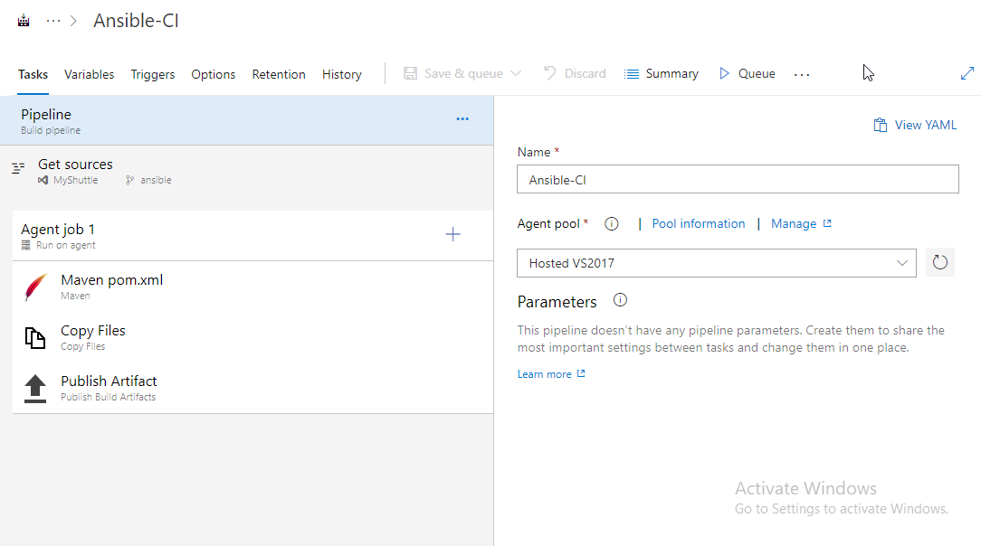
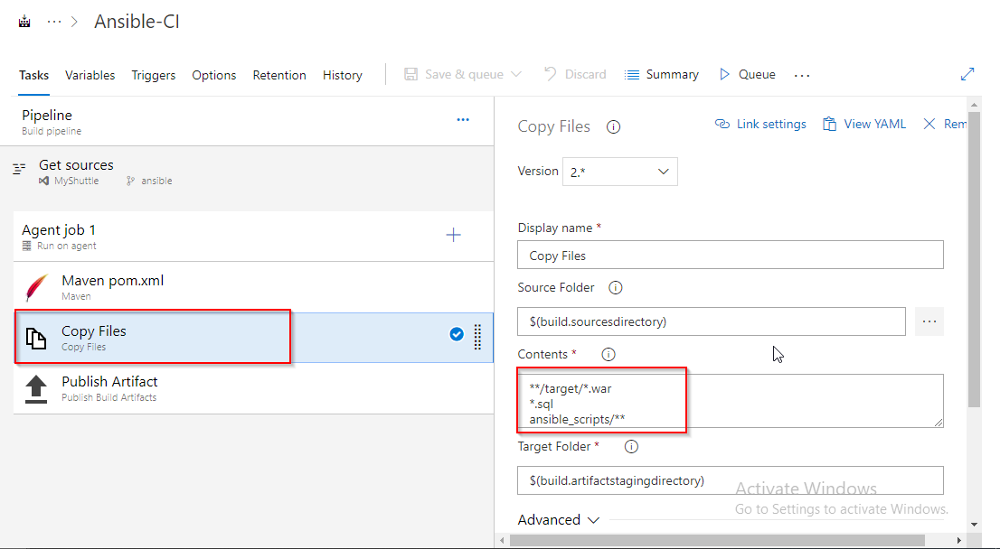

**Automating Infrastructure Deployments in the Cloud with Ansible and Azure Pipelines**

**Overview**

[Ansible](https://www.ansible.com/) is an open-source tool that automates cloud provisioning, configuration management, and application deployments. Using Ansible you can provision virtual machines, containers, network, and complete cloud infrastructures. In addition, Ansible allows you to automate the deployment and configuration of resources in your environment.

[Ansible Playbooks](https://docs.ansible.com/ansible/latest/user_guide/playbooks.html) are Ansible’s configuration, deployment, and orchestration language. They can describe a policy you want your remote systems to enforce or a set of steps in a general IT process. These playbooks use YAML file format to define a model of a configuration or a process.

Ansible includes a suite of [Ansible modules](http://docs.ansible.com/ansible/latest/modules_by_category.html) that can be executed directly on remote hosts or via playbooks. Users can also create their own modules. Modules can be used to control system resources - such as services, packages, or files - or execute system commands.

For interacting with Azure services, Ansible includes a suite of [Ansible cloud modules](http://docs.ansible.com/ansible/list_of_cloud_modules.html#azure) that provides the tools to easily create and orchestrate your infrastructure on Azure.

**What’s covered in this lab**

In this lab, you will see

1. How Ansible can be used to implement Infrastructure as a Code (IaaC)

2. How to automate infrastructure deployments in the Cloud with Ansible and Azure pipelines.

**Prerequisites**

1. You will need a valid and active Microsoft Azure account for the Azure labs. If you do not have one, you can signup for a free trial account [here](https://azure.microsoft.com/en-us/free/).

2. You will need an **Azure DevOps account**. If you do not have one, you can sign up for free [here](https://azure.microsoft.com/en-us/services/devops/).

3. Use the [Azure DevOps Demo Generator](https://azuredevopsdemogenerator.azurewebsites.net/) to provision the project on your Azure DevOps organization. This URL will automatically select the **Ansible **template for you in the demo generator. If you want to use other projects, use the URL instead - [https://azuredevopsdemogenerator.azurewebsites.net/](https://azuredevopsdemogenerator.azurewebsites.net/)

Follow the [simple walkthrough](https://docs.microsoft.com/en-us/azure/devops/demo-gen/use-vsts-demo-generator-v2?view=vsts) to know how to use the Azure DevOps Demo Generator.

**Task 1: Create an Azure Service Principal**

This step is required so that Ansible can log in to Azure with non-interactive authentication. We will define a service principal and an application ID for the Azure.

1. Login to [Azure portal](https://portal.azure.com) in a browser.

2. Click on **Cloud Shell **and select **Bash.**

3. Type the following command by replacing ServicePrincipalName and PASSWORD with your desired values

    `az ad sp create-for-rbac --name ServicePrincipalName --password PASSWORD `

4. It will give you a JSON output as shown in the image. Note down the **appId, Password, **and** tenantID.**

5. Type the following command to get Azure **SubscriptionID **and Note it down.

      `az account show`
      

Follow the directions in the section of the **Create the service principal **section in the article, [Create an Azure service principal with Azure CLI 2.0](https://docs.microsoft.com/cli/azure/create-an-azure-service-principal-azure-cli?view=azure-cli-latest#create-the-service-principal) for more information.

**Task 2: Configure Ansible in a LINUX VM**

To create and provision the resources in Azure with Ansible, we need to have access to a LINUX VM which is configured with Ansible.

In this exercise, we will deploy a LINUX VM which is pre-installed with Ansible and configure it to work with Azure.
{:target="_blank"}

1. Click on the **Deploy to Azure **button (or right click and select **_open in new tab_** option) to spin up an **Ubuntu 18.04 **VM. Enter the required details for the below fields, agree to the **_Terms and Conditions_**, and then click on the **Purchase **button.

* Subscription

* Resource Group

* Location

* Virtual Machine Name

* Virtual Machine Size

* Admin User Name

* Admin Password

This template creates an Ubuntu Virtual Machine in the desired Resource Group and runs a script to install the Ansible and Azure dependencies.

2. It takes about 5 minutes to provision the environment. Once the deployment succeeds, a notification is displayed in the Azure portal. Click on the **Go to resource group** button.

3. Click on the VM resource component and click on **connect **and copy the login command under the **SSH **tab.

4. Open Command prompt and paste the copied login command and log in. It will prompt for authentication, type Yes and provide the Password.

5. Now we must create a directory named **_.azure_** in the home directory and a **_credentials_**** **file under it. Type the following commands to create them.

     `mkdir ~/.azure
     
      nano ~/.azure/credentials
      `
6. Insert the following lines into the **_credentials_** file - replacing the placeholders with the information from the service principal creation.
        `
         [default]
        
         subscription_id=<your-subscription_id>
         
         client_id=<security-principal-appid>
         
         secret=<security-principal-password>
         
         tenant=<security-principal-tenant>
         `
         

7. Now save and close the file.

8. And lastly, we will create a pair of private/public keys and install the public key in the local machine.
      `
      ssh-keygen -t rsa
      
      `

**Note: **Replace ‘vmadmin’ with your virtual machine’s admin username.

9. In the next step, we must create a *service connection *in our project. For that, we need the private key. To copy the private key, follow this command, it will give you the private key. Copy and paste it in a notepad.

**Task 3: Create a Service Connection**

To connect and run playbooks through ansible VM in Azure pipelines, we need to have some authentication established between our pipeline and VM.  This service connection provides authentication to Ansible.

1. Navigate to the project we created above using [Azure DevOps Demo Generator](https://azuredevopsdemogenerator.azurewebsites.net/).

2. Go to **Project settings >> **select **Service Connections.**

3. Click on **New Service Connection **and select **SSH.**

4. In the service, connection provide details of Ansible VM and paste the private key we created in Task 2 and click **OK **to save.

**Exercise 1: Examine the Playbook in your source code**

In this lab, we will use MyShuttle which is an example cab booking web application developed using Java. We will examine the Ansible playbook which helps you to provision the Azure resources required to deploy MyShuttle application.

1. Navigate to the project we created above using [Azure DevOps Demo Generator](https://azuredevopsdemogenerator.azurewebsites.net/).

2. Select the **Repos**. Make sure that you are on the **ansible **branch. If not switch to **ansible **branch.

3. Select the **webapp.yml **file under the **ansible_scripts** folder. Go through the code.

**Webapp.yml **is an Ansible playbook file written in YAML format.

In this example, we want to deploy an Azure resource group, App service plan, App service, and MySQL database required to deploy the website. And we have added Ansible playbook to source control repository in our Azure DevOps project which can deploy the required Azure resources.

**Exercise 2: Build your application using Azure CI Pipeline**

In this exercise, we will build our application and publish the required files to an artifact called drop.

1. Navigate to **Pipeline > Builds**. Select **Ansible-CI **and click **Edit.**

2. Your build pipeline will look like as below. This CI pipeline has tasks to compile, build, test and publish the build output into a war file(package) which can be deployed to a web application.

3. In addition to the application build, we need to publish Ansible scripts and database file so that it will be available in CD pipeline. So, we configured **Copy files **task to copy Ansible playbook and database file along with **.war **file to Artifacts directory.

4. Now click **Queue **to trigger the build. Once the build success, verify that the artifacts have **Ansible_Scripts **folder and **CreateMYSQLDB.sql **along with **myshuttledev.war **file in the drop.

**Exercise 3: Deploy resources using Ansible in Azure CD Pipeline**

In this exercise, we will create azure resources using Ansible as part of our deployment (CD) pipeline and deploy the MyShuttle application to the App service provisioned by Ansible.

1. Navigate to **Pipeline >> Releases.** Select **Ansible-CD **and click **Edit Pipeline.**

2. Select **Dev **stage and click **View stage Tasks **to view the pipeline tasks. 

You will see the tasks like below image.

3. Select the **Replace Tokens **task.

If you observe the **webapp.yml **file in **Exercise 1, Step 3 **you will see there are few values are suffixed and prefixed with **__**. For example, **__webappname__. **Using **Replace Tokens **task we will replace values with the variable values defined in the release pipeline.

4. Select the **Ansible **task. Select **Ansible Location **as **Remote Machine **and select **Ansible SSH endpoint** that we created in **Task 3.**

5. Select **Execute Azure MySQL **task. Select azure service connection from the drop-down.

6. Select **Azure App Service Deploy** task. Select Azure service connection from the drop-down.

7. Click on **Save** and then **+Release | Create Release** to start a new release.

8. Once the release is success navigate to your Azure portal. Search for **myshuttle **in App services. Select the app that created with **myshuttle-xxxx **and browse to view the application deployed. Select the **URL** from the overview blade. Add **/myshuttledev** context to the URL. For instance - [http://myshuttle1.azurewebsites.net/myshuttledev](http://myshuttle1.azurewebsites.net/myshuttledev)

9. Select **Login** and try logging in to the site with any one of the following credentials.

10. If your database was setup correctly and the connection parameters are valid, you should be able to login to the portal.

**Summary**

In this lab, you have learnt how to deploy Azure resources automatically with Ansible and deploy the application with Azure Pipelines.

